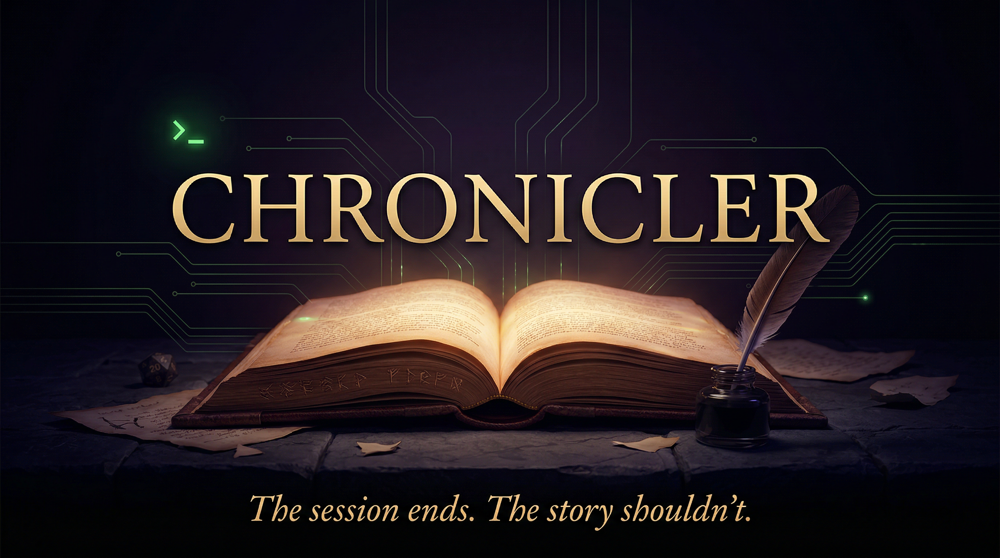

# Chronicler



[](https://github.com/ScottSucksAtProgramming/chronicler/actions/workflows/ci.yml)
[](https://pypi.org/project/chronicler-ttrpg/)

Chronicler is an AI agent that turns tabletop RPG session recordings into a
living Obsidian campaign vault. Feed it session PDFs or transcripts, and it
extracts NPCs, locations, factions, plot threads, and key events — then writes
linked notes you can actually use at the table.

> **macOS only.** The Obsidian integration depends on the macOS desktop app.

## Install

```bash
uv tool install chronicler-ttrpg
```

Then run the setup wizard:

```bash
chronicler config init
chronicler init
```

See [docs/installation.md](docs/installation.md) for prerequisites and a
step-by-step walkthrough.

## Quick Start

```bash
# Add your player characters
chronicler party add --player "Alice" --character "Nyra" --class "Wizard"

# Ingest a session
chronicler ingest --session 1 /path/to/session-01.pdf

# Review the vault
chronicler review
chronicler ask
```

The [Quick Start guide](docs/quick-start.md) walks through your first session
end-to-end.

## Documentation

| Guide | Contents |
|---|---|
| [Installation](docs/installation.md) | Prerequisites, install options, initial config |
| [Quick Start](docs/quick-start.md) | First session walkthrough |
| [Command Reference](docs/commands.md) | Every command, flag, and example |
| [Configuration](docs/configuration.md) | All settings and environment variables |
| [Workflows](docs/workflows.md) | Backlog processing, active campaign, knowledge import |
| [Troubleshooting](docs/troubleshooting.md) | Common errors and fixes |
| [Development](docs/development.md) | Dev environment, tests, contributing |

## License

GNU AGPL v3 or later — see [LICENSE](LICENSE).
